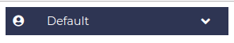
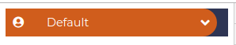
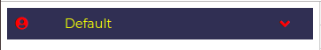
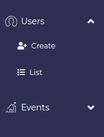

# vue-drip-collapse
Vue Drip Collapse is solution that could help you about use collapse with VueJS 🎨

 [](https://www.npmjs.com/package/@arikardnoir/vue-drip-collapse) <a href="https://www.npmjs.com/package/@arikardnoir/vue-drip-collapse"> [](LICENSE)
> A Vue.js plugin to easily integrate button in your projects.

Vue Drip Collapse is a Collapse that give you lot of alternatives to work with.

## Instalation
Install the package from npm by running:
``` bash
# install dependencies
npm i @arikardnoir/vue-drip-collapse
```

## Usage
Import, register and place the component in your Vue app.
```html
<template>   

  <VueDripCollapse icon="nextbss-bar-chart" 
            title="Users" 
            backgroundColor="#2e3553" 
            hoverColor="#d05d1c"
            iconColor="#d05d1c"
            titleColor="#fff"
            >
        <router-link :to="{ name: 'RegistUser' }" tag="li">
            <a class="col-intern" href>
                <i class="fas fa-user-plus"></i>
                <span>Create</span>
            </a>
            </router-link>
            <router-link :to="{ name: 'ListUser' }" tag="li">
            <a class="col-intern" href>
                <i class="fas fa-list"></i>
                <span>List</span>
            </a>
        </router-link>
  </VueDripCollapse>
  <VueDripCollapse icon="nextbss-bar-chart" 
            title="Events" 
            backgroundColor="#2e3553" 
            hoverColor="#d05d1c" 
            iconColor="#d05d1c" 
            titleColor="#fff"
            >
        <router-link :to="{ name: 'ListEvent' }" tag="li">
            <a class="col-intern" href>
                <i class="fas fa-list"></i>
                <span>List</span>
            </a>
        </router-link>
  </VueDripCollapse>
</template>
```

```js
import VueDripCollapse from '@arikardnoir/vue-drip-collapse'

export default {
  components: {
    VueDripCollapse,
  }
}
```

## Props
Components Property that make him cool

|Name              |Type          |Default              |Description                                           |
|------------------|--------------|---------------------|------------------------------------------------------|
|icon              |String        |fas fa-user-circle   |choose the fa fa-icon you want                        |
|title             |String        |Default              |Collapse title                                        |
|backgroundColor   |String        |#d05d1c              |Background of collapse                                |
|hoverColor        |String        |#d05d1c              |Collapse mouse hover color                            |
|iconColor         |String        |                     |fa fa-icon icon color                                 |
|titleColor        |String        |                     |Collapse title text color                             |


## More
We are using Font Awesome as icons [Access](https://fontawesome.com/v4.7.0/icons/)

## Examples
Some examples & Looks that how you could use this component

Normal Collapse

 

Hover Collapse

   

Color changed on Title and Icons

   

Example above, about using Collapses on your projects

   